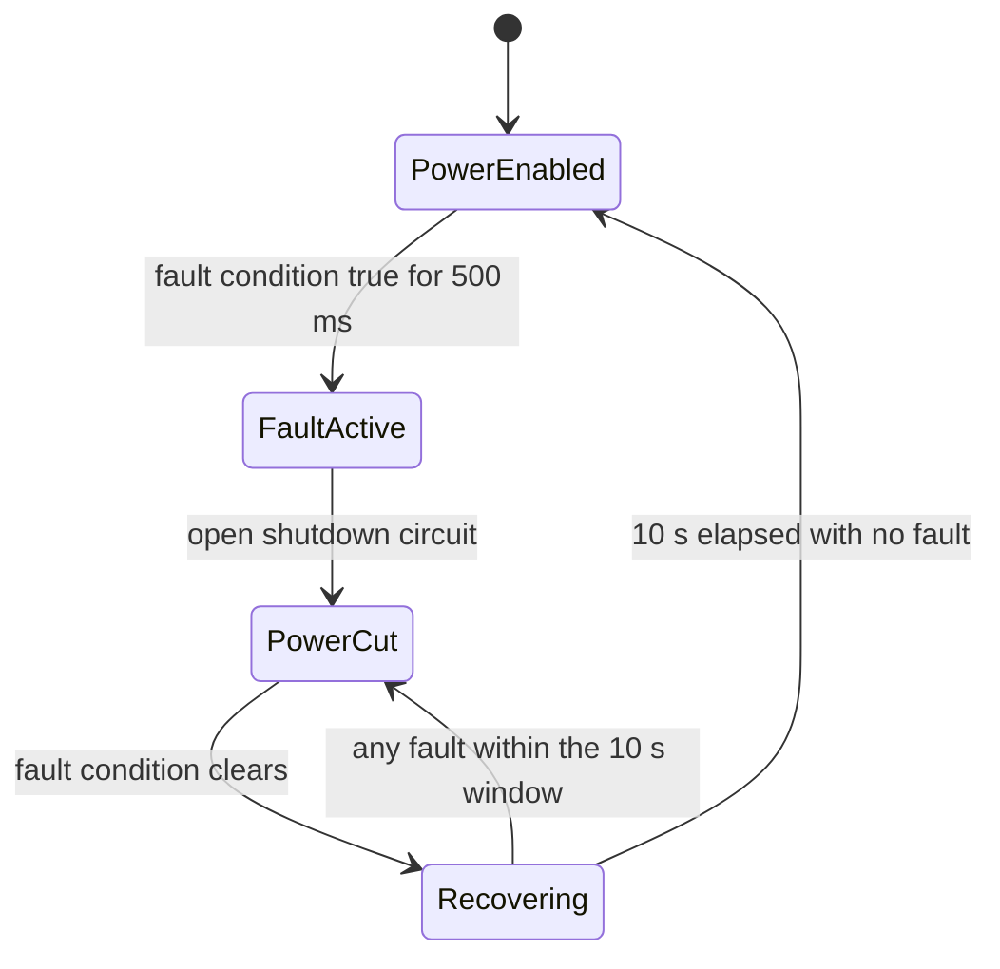

# Brake System Plausibility Device (BSPD)

**Manchester Stinger Motorsports** · Rev V4.0 · KiCad 7

The BSPD is a **non-programmable safety circuit**, implemented entirely in discrete
logic with **no microcontroller anywhere in the fault-detection or shutdown path**.
It continuously monitors the throttle position sensor (TPS) and brake pressure
sensor (BPS) and cuts power to the vehicle if either reports an implausible
condition.

---

## Fault conditions

### 1. Simultaneous brake and throttle
If the BPS indicates the brakes are applied while the TPS reads **more than 25 %
above idle position**, and both conditions persist continuously for **500 ms**, the
circuit cuts power to the vehicle.

### 2. Sensor signal out of range
If either the TPS or BPS signal falls outside the expected **0.5 V – 4.5 V** range
for **500 ms** — indicating a wiring fault, sensor failure, or an open or short
circuit — the circuit cuts power.

## Reset behaviour
Once the fault condition is no longer present, a **10-second timer** starts. If no
fault condition occurs during that 10-second window, power is automatically
restored.



---

## How it works

| Stage | Implementation |
|-------|----------------|
| 5 V rail | `LM7805` / `LF50` regulator from the 12 V supply |
| Sensor range check | `LM339` window comparators against the 0.5 V / 4.5 V limits |
| 25 %-above-idle threshold | `LM339` comparator vs. a trimmer-set reference (Bourns 3386P, one per sensor) |
| Fault combination logic | `74HC00` quad NAND gate |
| 500 ms fault debounce | `LM555` timer |
| 10 s reset delay | `LM555` timer |
| Power cut | signal transistors (`2N3904` / `2N3906`) driving the Panasonic ALQ-series relay |

Test points are broken out for the sensor thresholds, the 500 ms and 10 s timer
outputs, the combined logic output, and the relay drive signal.

---

## Repository layout

```
BSPD PCB/
├── BSPD_ManchesterStingerMotorsports.kicad_pro    project file
├── BSPD_ManchesterStingerMotorsports.kicad_sch    schematic
├── BSPD_ManchesterStingerMotorsports.kicad_pcb    board layout (2-layer, 1.6 mm)
├── fp-lib-table                                   project footprint library table
├── footprints/
│   ├── BSPD_footprints.pretty/                    custom footprints (ALQ305 relay, 3386P trimmer)
│   └── 3D/                                        STEP models for the custom parts
└── Logo B&W.png                                   silkscreen logo
```

## Opening the project

1. Install **KiCad 7.0 or later** (<https://www.kicad.org/download/>).
2. Open `BSPD PCB/BSPD_ManchesterStingerMotorsports.kicad_pro`.

The custom footprint library is referenced through `fp-lib-table` with a relative
path (`${KIPRJMOD}`), so it resolves automatically wherever the repository is
cloned — no manual library setup required.

---

## Status

Revision **V4.0** (2024-06-10). See the schematic title block for the current
revision and the commit history for changes.
